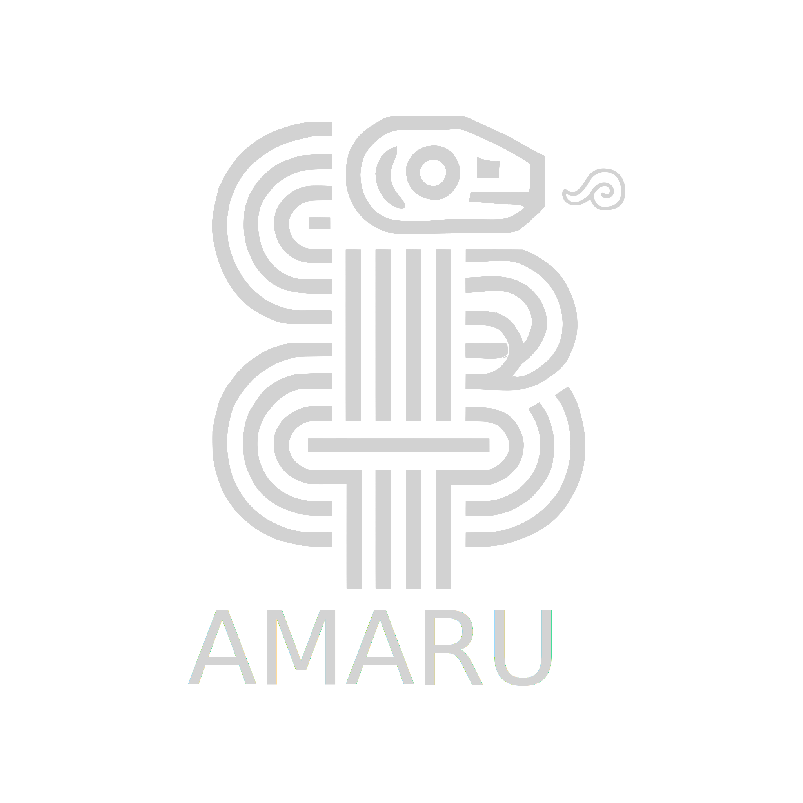

<p align="center">
  
</p>

# Amaru: Next Generation Antivirus 🛡️  

Origin: Mythological Inca serpent that guards treasures.
Analogy: Coils and neutralizes threats.

**Open-source antivirus for Windows 11 with real-time scanning, YARA rules, Radare2 integration, and Rust-powered efficiency.**  

[](https://www.gnu.org/licenses/old-licenses/gpl-2.0.en.html)  
  

---

## 📖 Overview  
Amaru is a community-driven fork of ClamWin, supercharged with modern malware detection capabilities:  
- **Real-time protection** via Rust-native file monitoring.  
- **Heuristic analysis** using YARA rules and Radare2 static analysis.  
- **Low resource consumption** thanks to Rust-optimized modules.  

Designed for users who value transparency, customization, and Windows 11 compatibility.  

---

## ✨ Key Features  
| **Feature**               | **Technology**          | **Description**                                      |  
|---------------------------|-------------------------|------------------------------------------------------|  
| Real-Time File Monitoring | `notify-rs` + ClamAV    | Watches file changes and scans instantly.            |  
| YARA Rule Engine          | YARA 4.3+               | Detects malware patterns with custom/signed rules.   |  
| Static Analysis           | Radare2                 | Examines PE headers, sections, and suspicious strings.|  
| Low-Level Performance     | Rust                    | Memory-safe modules for scanning and hooks.          |  
| Windows 11 Integration    | WinAPI + WFP            | Native kernel-level file filtering.                  |  

---

## 🛠️ Installation  

### Prerequisites  
- **Rust** (v1.70+): [Install Guide](https://www.rust-lang.org/tools/install)  
- **YARA** (v4.3+): [Build Instructions](https://yara.readthedocs.io/en/stable/gettingstarted.html)  
- **Radare2** (Windows build): [Download](https://radare.mikelloc.com/)  
- **ClamAV Database**: `clamav-update` (included in setup).  

### Steps  
1. Clone the repository:  
   ```bash
   git clone https://github.com/CripterHack/Amaru.git
   cd Amaru
   ```

2. Install dependencies:  
   ```powershell
   # Install Rust crates
   cargo install --path ./realtime-monitor
   # Setup YARA rules
   cp ./yara-rules/malware_rules.yar /etc/amaru/
   ```

3. Build the project:  
   ```bash
   cargo build --release  # Rust components
   cmake -B build -DCMAKE_BUILD_TYPE=Release  # C++/ClamWin components
   cmake --build build --config Release
   ```

4. Start the real-time service:  
   ```powershell
   .\target\release\amaru.exe --service start
   ```

---

## 🚀 Usage  

### Basic Commands  
| Command                          | Description                          |  
|----------------------------------|--------------------------------------|  
| `amaru scan --path C:\`     | Full system scan.                    |  
| `amaru monitor --start`     | Enable real-time protection.         |  
| `amaru update --rules`      | Fetch latest YARA/ClamAV signatures. |  

### Custom YARA Rules  
1. Add rules to `/etc/amaru/custom_rules.yar`.  
2. Reload the engine:  
   ```powershell
   amaru reload --rules
   ```

### Radare2 Analysis Integration  
```bash
amaru analyze --file suspect.exe --radare2
# Output: PE sections, imports, and risk score.
```

---

## 📂 Project Structure  
```  
amaru/  
├── clamwin/           # Modified ClamWin core  
├── yara-engine/       # YARA-Rust FFI bindings  
├── realtime-monitor/  # File watcher (Rust)  
├── radare2-analyzer/  # Static analysis integration  
└── signatures/        # YARA/ClamAV rules  
```

---

## 🤝 Contributing  
We welcome PRs! Follow these steps:  
1. Fork the repository.  
2. Create a feature branch: `git checkout -b feat/your-feature`.  
3. Adhere to the [Rust Coding Style](https://github.com/rust-lang/rfcs/blob/master/style-guide/README.md).  
4. Submit a PR with tests and documentation.  

### Funding  
Support us via:  
- [GitHub Sponsors](https://github.com/sponsors/CripterHack)  
- [Open Collective](https://opencollective.com/Amaru)  

---

## 📜 License  
GNU GPLv2. See [LICENSE](LICENSE) for details.  

---

## 🙌 Acknowledgments  
- Original [ClamWin](https://github.com/clamwin/clamwin) Team.  
- VirusTotal for [YARA](https://github.com/VirusTotal/yara).  
- Radare2 community for the reverse-engineering framework.  
- Rust contributors for memory-safe systems programming.  

---

*Disclaimer: Amaru is a community project. It is not endorsed by Cisco Talos or the official ClamAV team.*  
```
### 📌 Next Steps  
1. Customize the `signatures/` section with your YARA rule examples.  
2. Add a [CODE_OF_CONDUCT.md](https://www.contributor-covenant.org/) if needed.  
3. Integrate cross Linux/MacOS support

¡Happy coding! 🦀🔍