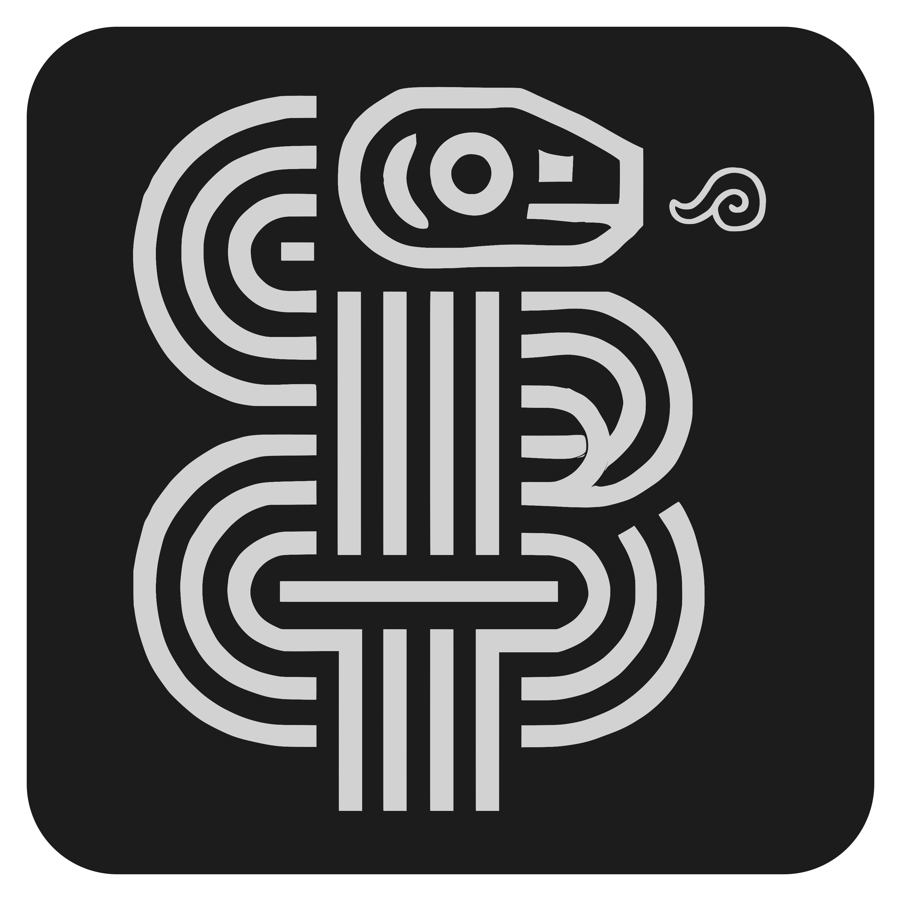

# Amaru: Next Generation Antivirus 🛡️

<p align="center">
  
</p>

> ⚠️ **Warning**: By now this is an experimental, in-progress version of Amaru Antivirus. It is currently under active development and should not be used in production environments. Features may be incomplete, unstable or subject to significant changes. Use at your own risk.

Origin: Mythological Inca serpent that guards treasures.  
Analogy: Coils around and neutralizes threats.

**Open-source antivirus for Windows 11 with real-time scanning, YARA rules, Radare2 integration, and Rust-powered efficiency.**

[](https://www.gnu.org/licenses/old-licenses/gpl-2.0.en.html)


---

## 📖 Overview
Amaru is a community-driven fork of ClamWin, supercharged with modern malware detection capabilities:
- **Real-time protection** via Rust-native file monitoring
- **Heuristic analysis** using YARA rules and Radare2 static analysis
- **Low resource consumption** thanks to Rust-optimized modules
- **Modern UI** built with Tauri + Svelte + TailwindCSS

Designed for users who value transparency, customization, and Windows 11 compatibility.

---

## ✨ Key Features
| **Feature**               | **Technology**          | **Description**                                      |
|--------------------------|-------------------------|---------------------------------------------------|
| Real-Time File Monitoring | `notify-rs` + ClamAV    | Watches file changes and scans instantly            |
| YARA Rule Engine         | YARA 4.3+              | Detects malware patterns with custom/signed rules   |
| Static Analysis          | Radare2                | Examines PE headers, sections, and suspicious strings|
| Low-Level Performance    | Rust                   | Memory-safe modules for scanning and hooks          |
| Windows 11 Integration   | WinAPI + WFP           | Native kernel-level file filtering                 |
| Modern UI               | Tauri + Svelte         | Responsive and efficient user interface            |

---

## 🛠️ System Requirements

### Minimum Requirements
- Windows 11 (64-bit)
- 4GB RAM
- 1GB free disk space
- Admin privileges for real-time protection

### Recommended Requirements
- Windows 11 (64-bit, version 22H2 or later)
- 8GB RAM
- 2GB free disk space
- SSD storage
- Admin privileges

### Developer Requirements
- Rust toolchain (1.70 or later)
- Node.js 18 or later (for UI development)
- Visual Studio Build Tools with C++ workload
- Git for Windows

---

## 📥 Installation

### End User Installation
1. Download the latest release from the [Releases page](https://github.com/CripterHack/Amaru/releases).
2. Run the installer with administrator privileges.
3. Follow the on-screen instructions to complete the installation.

### Manual Installation
1. Install the required dependencies (YARA 4.3+ and Radare2).
2. Download the pre-built binary package.
3. Extract to your desired location.
4. Run `amaru-setup.exe` to configure the service components.

### Developer Installation
1. **Install Rust:**
   ```powershell
   winget install Rustlang.Rust.MSVC
   rustup toolchain install nightly
   rustup default nightly
   ```

2. **Install Dependencies:**
   ```powershell
   # Install Radare2
   winget install radare.radare2
   
   # Install YARA (4.3+)
   # Download from https://github.com/VirusTotal/yara/releases
   
   # For UI development
   winget install OpenJS.NodeJS.LTS
   ```

3. **Clone and Build:**
   ```powershell
   git clone https://github.com/CripterHack/Amaru.git
   cd Amaru
   
   # Build backend
   cargo build --release
   
   # Build GUI
   cd gui
   npm install
   npm run build
   
   # Build complete package
   cd ..
   cargo run --bin amaru-packager
   ```

4. **Configure:**
   ```powershell
   copy .env.example .env
   # Edit .env with your settings
   ```

5. **Run Examples:**
   ```powershell
   # Run the EICAR test file detection example
   cargo run --example eicar_detection
   
   # Run other examples
   cargo run --example use_core_services
   ```

---

## 🚀 Usage

### GUI Interface
The most user-friendly way to interact with Amaru is through its graphical interface:
1. Launch Amaru from the Start menu or desktop shortcut.
2. Use the dashboard to view protection status and recent events.
3. Schedule scans and configure protection settings through the Settings page.

### Command Line Interface
Amaru provides a powerful command-line interface for advanced users and automation:

```powershell
# Scan a specific file
amaru scan --path C:\path\to\file.exe

# Scan a directory recursively
amaru scan --path C:\Users\Documents --recursive

# Enable real-time protection
amaru monitor --action start

# Update YARA rules
amaru update --rules

# Analyze a suspicious file with detailed reporting
amaru analyze --file C:\suspicious\file.exe --radare2 --heuristic

# Test detection capabilities with EICAR test file
amaru test-eicar

# Check service status
amaru service --action status
```

### Windows Service
Amaru runs as a Windows service for real-time protection:

```powershell
# Install the service (admin privileges required)
amaru service --action install

# Start the service
amaru service --action start

# Stop the service
amaru service --action stop

# Check service status
amaru service --action status
```

### Scheduling
Configure scheduled scans with the built-in scheduler:

```powershell
# Schedule a daily scan at 3 AM
amaru schedule --daily --time "03:00" --path "C:\Users"

# Schedule a weekly scan on Sundays
amaru schedule --weekly --day Sunday --time "02:00" --path "C:\"
```

---

## 🛡️ Security Features

### Real-time Protection
- **File System Monitoring:** Detects and scans files as they're created or modified
- **Process Behavior Analysis:** Monitors process activities for suspicious behavior
- **Network Traffic Inspection:** Integrates with Windows Filtering Platform
- **Executable Analysis:** Deep inspection of PE files before execution

### Scanning Capabilities
- **Signature-Based Detection:** Using YARA rules and ClamAV databases
- **Heuristic Analysis:** Detects suspicious patterns and behaviors
- **Memory Scanning:** Examines process memory for hidden threats
- **Static Analysis:** Uses Radare2 to analyze executable structure and behavior
- **EICAR Test Detection:** Recognizes the EICAR test file for antivirus validation

### Advanced Protection
- **Quarantine System:** Safely isolates detected threats
- **Behavioral Blocking:** Prevents suspicious activities in real-time
- **Reputation Checking:** Verifies file reputation against known safe files
- **Rootkit Detection:** Identifies hidden and privileged malware

---

## 📂 Project Structure
```
amaru/
├── src/                 # Core Rust implementation
├── gui/                 # Tauri + Svelte frontend
├── yara-engine/        # YARA integration
├── radare2-analyzer/   # Static analysis tools
├── realtime-monitor/   # File system monitor
├── updater/           # Update system
├── signatures/        # YARA rules
├── installer/         # Windows installer
└── docs/             # Documentation
```

## 🔧 Development

### Setup Development Environment
```powershell
# Install dev tools
cargo install cargo-watch cargo-audit

# Run tests
cargo test --all

# Development mode
cd gui
npm run dev
```

### Building from Source
```powershell
# Build release version
cargo build --release

# Build installer
cargo run --bin amaru-installer-builder

# Run tests
cargo test --all

# Build documentation
cargo doc --open
```

### Testing
```powershell
# Run unit tests
cargo test

# Run integration tests
cargo test --test '*'

# Run specific test
cargo test --test scan_test
```

### Debugging
```powershell
# Enable debug logging
$env:RUST_LOG="debug,amaru=trace"
cargo run

# Run with performance profiling
cargo run --features profile_allocation
```

---

## 📜 License
This project is licensed under the GNU General Public License v2.0 - see the [LICENSE](LICENSE) file for details.

## 🙏 Acknowledgments
- [ClamWin](http://www.clamwin.com/) - Original project
- [YARA](https://virustotal.github.io/yara/) - Pattern matching engine
- [Radare2](https://rada.re/n/) - Reverse engineering framework
- [Tauri](https://tauri.app/) - GUI framework
- [Svelte](https://svelte.dev/) - UI library
- [TailwindCSS](https://tailwindcss.com/) - Styling system

## 💬 Support and Community
- [Open an issue](https://github.com/CripterHack/Amaru/issues) for bug reports or feature requests

## 🔄 Contributing
Contributions are welcome! Please check the [CONTRIBUTING.md](CONTRIBUTING.md) file for guidelines.

---

*Disclaimer: Amaru is a community project and is not affiliated with or endorsed by ClamAV or Cisco Talos.*
